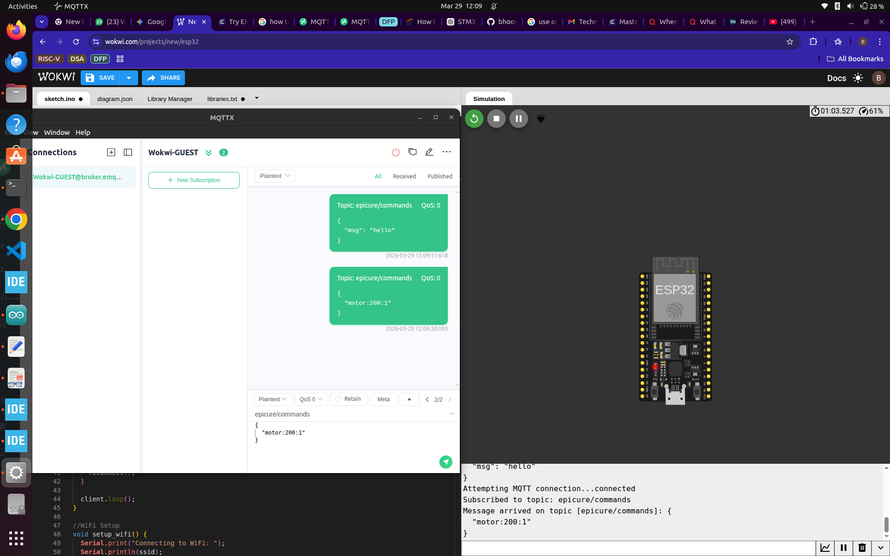
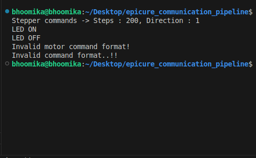
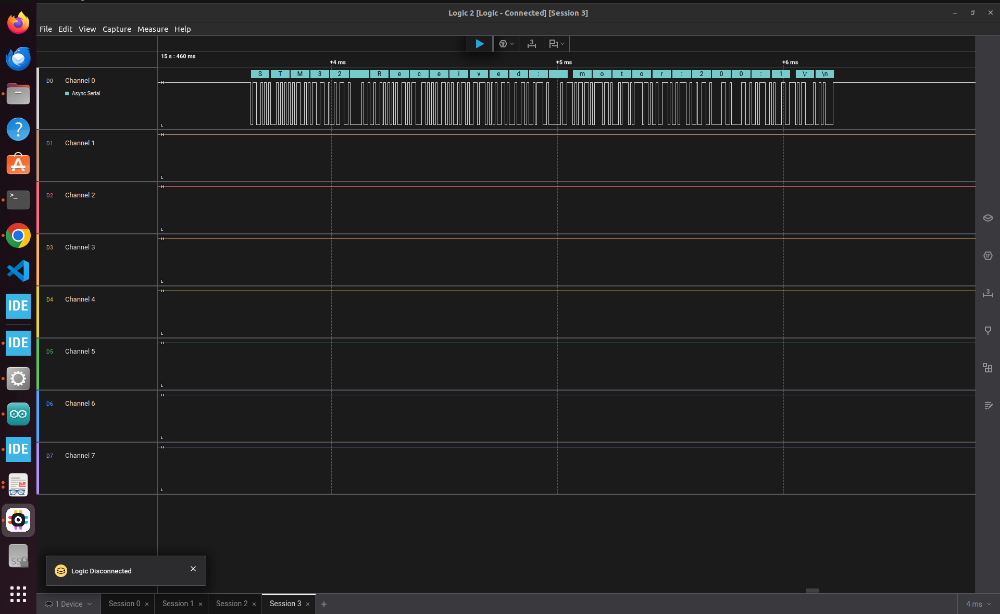
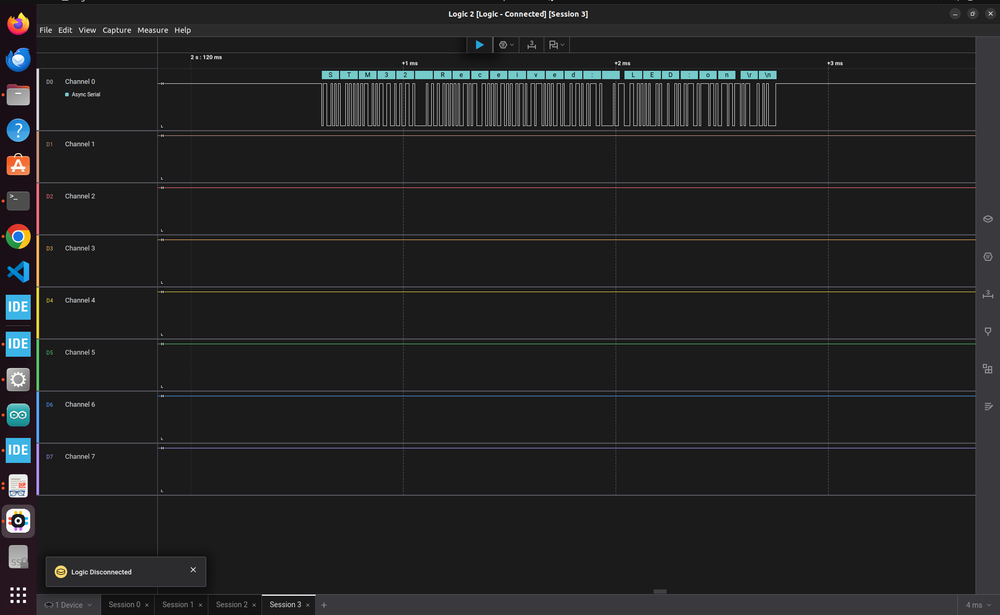

#  Epicure IoT Communication Pipeline

## Overview
This project implements a robust, two-stage IoT communication gateway. It bridges cloud-based MQTT commands to a microcontroller execution node using a custom-built, bare-metal hardware abstraction layer. 

The architecture is designed to decouple network handling from hardware execution, making it highly reliable and scalable for robotics and automation tasks.

##  System Architecture

The pipeline consists of two primary microcontrollers working in tandem:

### 1. The Network Gateway (ESP32)
* **Role:** Acts as the bridge between the internet and the local hardware.
* **Tech Stack:** C++, WiFi, PubSubClient.
* **Functionality:** Connects to the EMQX public broker, subscribes to the `epicure/commands` topic, and acts as an MQTT client. When a payload arrives, it immediately forwards the raw string over a hardware UART connection, appending a `\n` delimiter to frame the message.

### 2. The Execution Node (STM32F411 "Black Pill")
* **Role:** Parses incoming serial data and safely executes hardware commands.
* **Tech Stack:** C, Bare-Metal Register Programming.
* **Functionality:** Instead of relying on the standard STM32 HAL, this node utilizes **custom, register-level drivers** written from scratch for the UART, GPIO, and RCC peripherals. The application layer features a non-blocking string parser (`sscanf`, `strncmp`) that decodes variable-length commands (e.g., `motor:200:1` or `LED:on`) while implementing strict buffer overflow protection.

## Simulation & Testing Methodology

Because physical hardware implementation was optional for this assessment, and standard web simulators do not natively support bare-metal register execution for the STM32F411, I adopted a decoupled Software-in-the-Loop (SIL) approach to verify the system logic:

1. **Cloud-to-Gateway Simulation:** The ESP32 network layer was simulated using Wokwi to verify the WiFi stack, MQTT broker connection, and payload forwarding.
2. **Logic & Parsing Abstraction:** The STM32's `decode_cmd()` application logic was abstracted from the bare-metal UART drivers and compiled as a native C testbench using GCC. This allowed for unit testing of the string parsing and edge-case handling (e.g., rejecting malformed commands) independently of the physical hardware. 

##  Proof of Work & Logs

### 1. ESP32 MQTT Reception
*The ESP32 successfully connecting to the broker and forwarding the incoming message.*

### 2. STM32 Command Parsing
*The native C testbench verifying the string decoding, hardware stub execution, and error handling of the STM32 application logic.*

### 3. Saleae Logic Analyser Output

---
*Developed by Bhoomika Hardwani*
